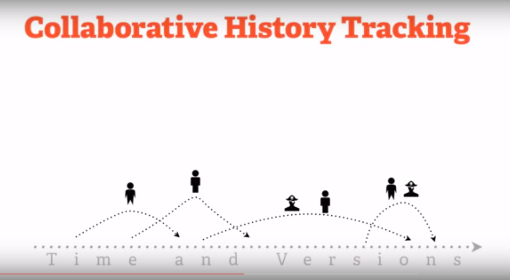

# Git Basics what is Git 

## Local Git
Distributed so that connectivity dosent block work.

Basically Git is more popular because it provides version control straight to the local system it dosent need any server to maintain a version control and check of every system.

Easy so that learning its commands can happen progressively.

Even if we need to collaborate with other employees it is easy to get started with them.

## Developer Dana
$ git init myproject
This will create a directory with the version control system files and control files which will track down the files of the project.

$ cd myproject  
This is the project directory where we can put documents images or anything you want.

$ git add .  
This is use to add your project files to the git version control system.

$ git commit -m "Importing all the code"  
This is basically permanently record the files and there time of commitment.

This is the simple version of git as it measures and maintain version control of the file. but actually the case is when we use Collaborative Git.

This is the problem when multiple users are working on the different machines working with same project and even working on the same file.

Git is designed up for Team-centric so that collaboration happens naturally.

## Collaborative History Tracking

