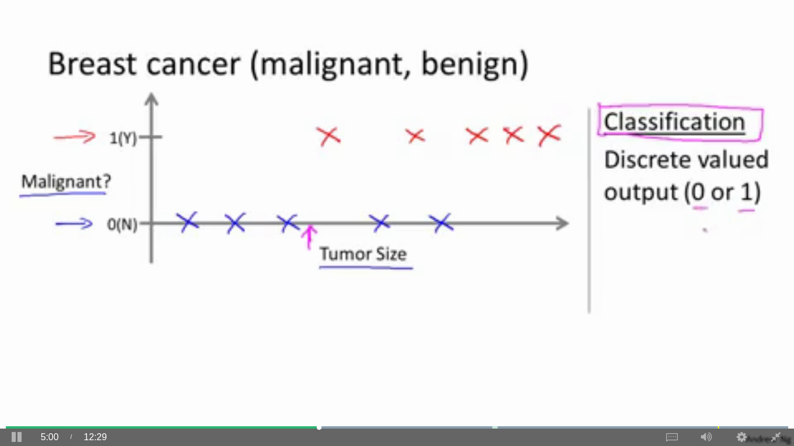
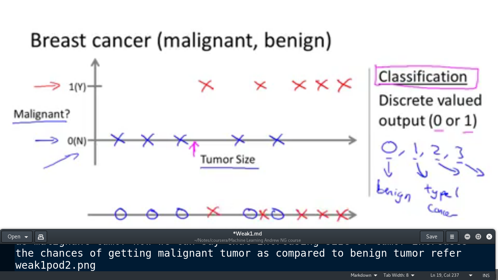
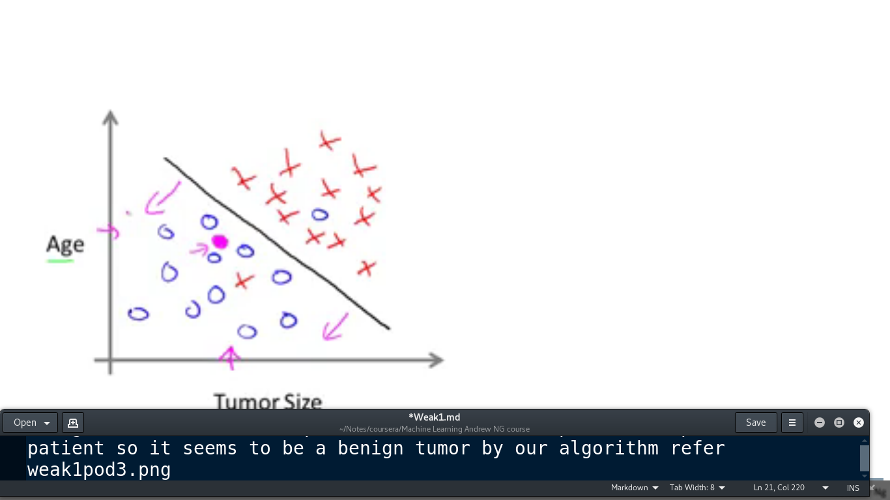
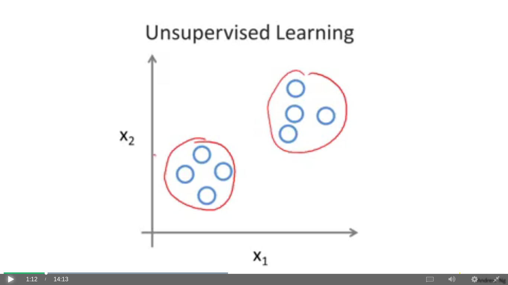
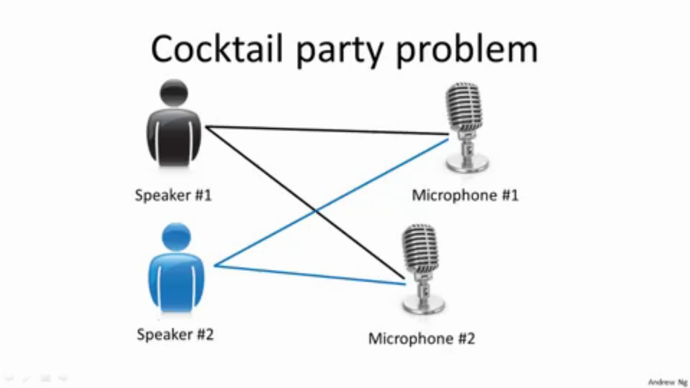
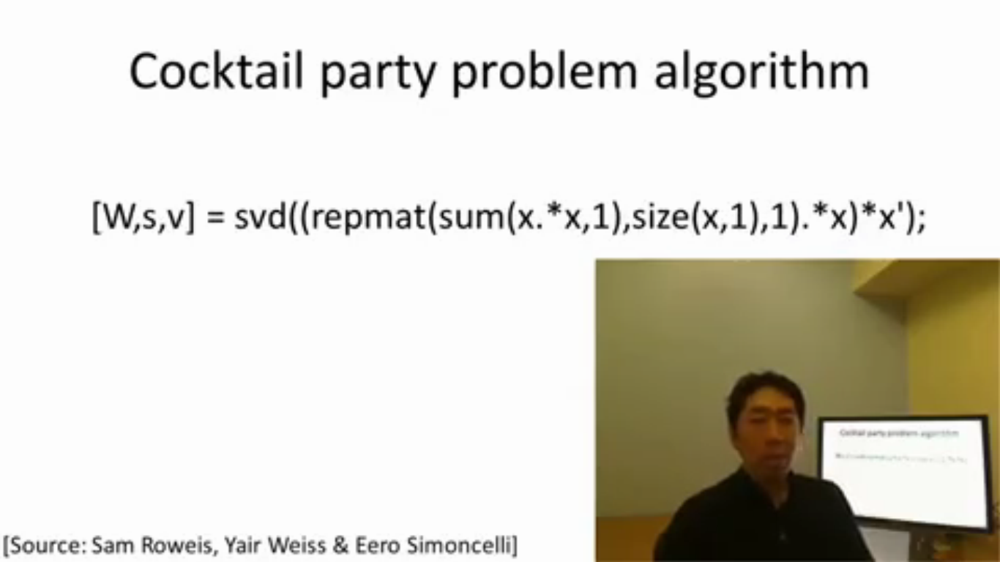

#				Machine Learning
============================================================================

## Defination Arthur Samuel (1959)
Field of study that gives computers the ability to learn without being explicitly programmed.
Note:- He is playing checkers and he is not a good player of checkers and he wrote a checkers playing program he tend to realize that while inputting 10's of 1000 of diiferent approches to play a game and it eventually play checkers better then a normal human being.

## Defination Tom Mitchell (1998)
A computer program is said to learn from experience E with respect to some task T and some performance measure P, if its performance on T, as measured by P, improves the experience E.

## Two types of learning algorithm
### 1 Supervised Learning 
It means the idea to teach the computer how to do something and
we gave the algorithm or we gave the data set which state what is the right price or what is the actual price of the house This basically act as a calculating averages using data set and plotting assumption points on graphs to find the results.

### 2 Unsupervised Learning
It means the computer will learn by itself

## Supervised Learning
### Regression
It means when we have a data set of large possible outcomes like I have a stock of 1000's of items and I want to calculate which stock is going to sell in the next 3 months then this is a regression problem where the amount of outcomes are very much
### Classification
It means when we have limited no of outcomes like there are 1000 employees in the company and I have to check weather there system is hacked or not so i take the outcomes as 0 for not hacked and 1 for hacked. so in this example we have a limited no of choice we can have multiple more then 2 choices but here we have 2 and this is a classified problem which can be easily solved.

### Example
so we take a example of breast cancer so there are two types of brest cancer tumor 1. Malignant Tumor and 2. benign tumor
malignant Tumor is harmfull and benign tumor is harmless
So in the 1st example we will plot Malignant and Tumor size where the size of tumor increases the chances of having malignant tumor more.

So now in the next example we have marked circle for the benign tumor and x as malignant tumor now we can say that increasing size of tumor increases the chances of getting malignant tumor as compared to benign tumor.

Now we will use Age and tumor size as the data set so there are two variables of measuring the chances of tumors where the age and tumor size increases the chances of having malignant tumor are more as compared to less age and small tumor size.
so now we have a patient with age less then the average age of having malignant tumor so he keeps behind the line The pink dot represents the patient so it seems to be a benign tumor by our algorithm.

In Unsupervised learning the data dont have any labels we only have a data set and we have to find the structure of data so we make grouping of common related data like making clusturs

## Unsupervised Learning
In supervised learning each example is having a particular dataset on which we apply average type mechanism to determine wheather the practice exist in which variable type but
In the below example we have clustured the data by grouping them

### Example
Google news in this google uses a clusturing algorithm to cluster same news from different websites and clustur them to form a single post and share multiple news channel websites in the post.
So everytime you visit to google news it shows the top and similar links of websites for the news around the web.

### Example 2
Clustering: Take a collection of 1,000,000 different genes, and find a way to automatically group these genes into groups that are somehow similar or related by different variables, such as lifespan, location, roles, and so on.

Genes DNA micro raw data the idea is to measure how much of the individuals have a certain genes of data to find that particular pattern of there genes data we group them together in form of clusturs specifying the types of genes and then we can say If a individual lies in between that pattern he may be part of the particular variety of data.
So this is unsupervised learning because we are not saying that this individual is from the specific group of data.

### Applications of unsupervised learning
1: Organized Computing Clusters :- we make a collection of different machines and clustur them together to work more efficiently
2: Social Network Ananlysis :- It identifies which friends email you more regularly on a particular platform but here we have not confirmed that user 1st preference of social network and then we identify which type of groups of they are.
3: Market Segmentation :- It automatically group the customers in different market segments which saves time and money as well.
4: Astronomical Data Algorithm :- This technique is used to find the patterns and lifespan of the stars to find there different otheer attributes.

### Cocktail party problem
Non-clustering: The "Cocktail Party Algorithm", allows you to find structure in a chaotic environment. (i.e. identifying individual voices and music from a mesh of sounds at a <a href="https://en.wikipedia.org/wiki/Cocktail_party_effect">cocktail party</a>).

cocktail party where there are two speakers in the room and there are two mics in the room and both the speakers speak at the same time and now it depends on the speaker voice loudness how much sound waves are captured by a particular mic.

So both the microphones are creating a overlapping voice channel by both speakers.
So now in this we have two voice recordings from two different mics situated in the room and in 1st speaker the voice of speaker1 comes more louder then the speaker2 because as such they are somehow powerfull weight.

Now the algorithm will do is to sum both the recordings and listen both the recordings and form clusturs of the two different voices and seperated them in two different sound files, So here we formed different clusturs for the same recording using different mics.

### Cocktail party problem algorithm
so to implement this problem algorithm we will be going to use octave in matlab so using such tools make many learning algorithms to be as a few lines of code

Functions used in the algorithm
svd :- Single value decomposition it turns out to be linear algebra routine 

